# Weimouren's Dreamcore Server 各个区域
## 三次更新
1. 1月初内测
2. 2/23
3. 6/20
4. 8/17

该文档存在剧透，请谨慎阅读！

<br />
<br />
<br />
<br />
<br />
<br />
<br />
<br />
<br />
<br />
<br />
<br />
<br />
<br />
<br />
<br />
<br />
<br />


Safety等级说明:

1. 等级1：无有害实体（大多数层级）
2. 等级2：存在至少1个有害实体，密度较小（07-02, 0A-02, 22, 24, 30-34）
3. 等级3：存在至少6个有害实体，密度较大（30-31, 30-33, 13）

## 区域01: 梦之酒店
Safety等级: 1

第二次更新后玩家的初始重生点。
### 区域01-001

**区域01-001**有一个前台，有2个NPC

### 区域01-001-Room 202

Entrance
1. 可通过区域01-001图中02进入。

### 区域01-002


Entrance
1. 可通过区域01-001图中01进入。

## 区域02-01:池核A区
Safety等级: 1

Entrance
1. 可通过区域01-002中Room 000 进入。

Exit
1. **区域02-01**到区域02-02在第3次更新前存在一个出口，其通往区域03.
2. -1,25,2的压力板可去往区域21

## 区域02-02:池核B区
Safety等级: 1
## 区域02-02-01:繁茂洞穴
Safety等级: 1
## 区域02-02-02:跑酷圣地
Safety等级: 1
## 区域03:草地长廊 (unreachable after 6/20)
Safety等级: 1

Exit
1. 走到草地长廊的尽头可以前往区域04
## 区域04:图书馆
Safety等级: 1
1. 第2次更新前存在一个按钮(10024 30 9994（注：该按钮已失效）)可以通往区域05
1. 按钮(10019 30 9924)可以通往区域05
## 区域05:立方体
Safety等级: 1
1. 立方体的顶端可以通往区域06

原位置可能位于overworld 10000 40 9000片区，截图已丢失
## 区域06:暗走廊
Safety等级: 1
1. 正z轴方向可去往区域12
2. 负z轴方向可去往区域02-02
## 区域07:郊区
Safety等级: 1

可从区域02-02去往
## 区域07-02:郊区
Safety等级: 2

可从区域02-02去往
存在躺在地上的敌对实体

文档作者留言：一上来有只狗就把我当狗整

## 区域08:滑滑梯
Safety等级: 1

可从区域02-02去往

## 区域09:视力测试
Safety等级: 1

可从区域02去往


## 区域0A-01:暗室
Safety等级: 1

可从区域02和区域21去往，可能还有其他入口
可使用扫描仪

## 区域0A-02:暗室 Pro max
Safety等级: 2

可从区域0A-01中绿色去往
存在潜伏者

文档作者留言:
```
[2026-8-17 17:44:01.631] [Render thread/INFO] [net.minecraft.client.gui.components.ChatComponent/]: [CHAT] <pfec_wlgyizhicat> wc theres somethign here
[2026-8-17 17:44:07.664] [Render thread/INFO] [net.minecraft.client.gui.components.ChatComponent/]: [CHAT] <pfec_wlgyizhicat> i错了
[2026-8-17 17:44:09.468] [Render thread/INFO] [net.minecraft.client.gui.components.ChatComponent/]: [System] [CHAT] pfec_wlgyizhicat被潜伏者杀死了
[2026-8-17 17:44:11.481] [Render thread/INFO] [net.minecraft.client.gui.components.ChatComponent/]: [CHAT] <pfec_wlgyizhicat> no
```

## 区域0B:破碎
Safety等级: 1

可从区域09去往（房子端）

## 区域0C:truely? (unreachable after 6/20)

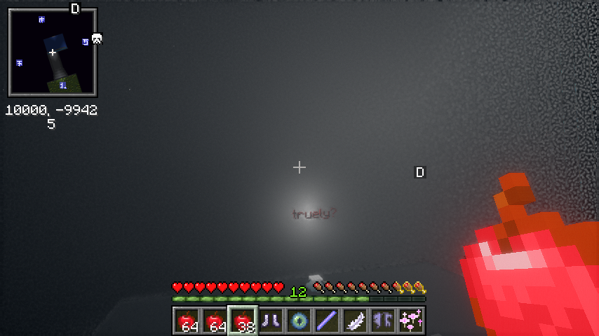

## 区域0D:建设服 2026/02/09 红砖迷宫  
与区域13为同一区域，见[区域13](#区域13红砖迷宫)
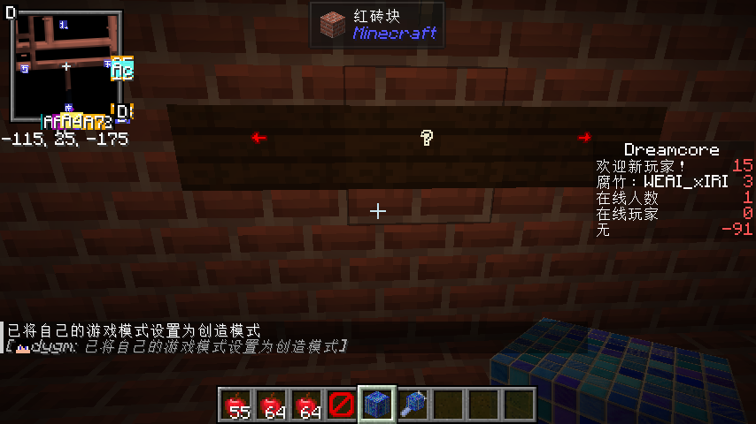

> 我并不位于建设组内，本人已无法通过正常手段进入建设服：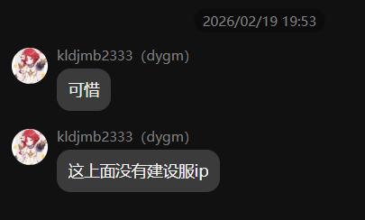


## 区域10:露天图书馆
Safety等级: 1

可从区域04去往

## 区域11:深水区
Safety等级: 1

可从区域02,区域24去往

## 区域12:暗走廊B区
Safety等级: 1

从区域06正z轴方向去往

## 区域13:红砖迷宫
Safety等级: 3

可从区域0A去往
## 区域14:黄昏之海(Dusksea)
Safety等级: 1

可从区域13去往
## 区域15:螺旋楼梯
Safety等级: 1

可从区域0B,区域11去往
## 区域16:dreamcore:light
Safety等级: 1

## 区域17
与区域15为同一区域，见[区域15](#区域15螺旋楼梯)


## 区域18:The end
Safety等级: 1


## 区域20:Level 94
Safety等级: 1

1. 区域12可去往
2. 区域27可以钻的画可去往
## 区域21:摩天办公楼
Safety等级: 1

## 区域22:无尽图书馆
Safety等级: 2

从区域10去往

## 区域23:儿童室
Safety等级: 1

## 区域24:地上砼核
Safety等级: 2

1. Level94一端有卡车的路面可去往
2. 区域09进去后反着走右边可去往
## 区域25:地铁站
Safety等级: 1

1. 区域26可去往
## 区域26:商场
Safety等级: 1

1. 区域12可去往
## 区域27:草地长廊
Safety等级: 1

长度比区域03长

## 区域30:云端酒店
Safety等级: 1

可从区域07去往


### 区域30-01:timing的实验室 (unreachable after complete plot)
Safety等级: 1

### 区域30-31 or 713-02:废弃医院 (unreachable after complete this area)
Safety等级: 3

可通过区域30-01（第二站）进入


通关该区域最大的难点在于处理路上的敌人

制定前进策略：利用Freecam mod找到记录2的位置，使用xaeromap标记位置，规划路线。

能尽量用风弹就尽量用

记录2的item_frame/summon minecraft:item_frame 2034.50 103.03 4986.50

最好备上不死图腾（防止血量过低似了）和风弹（暂时驱逐敌人）

[查看记录2（剧透预警）](./entities/aggre2.md)
### 区域30-32 or 713-01:无主的卧室 (unreachable after complete this area)
Safety等级: 1

可通过区域30-01（第一站）进入


[查看记录1（剧透预警）](./entities/aggre1.md)

## 区域30-33:办公室……? (unreachable after complete this area)
Safety等级: 3

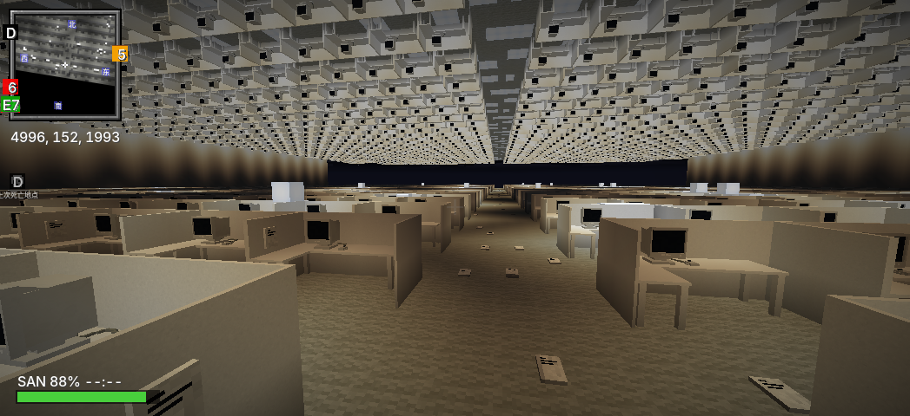

## 区域30-34 or 未知的地方-1:L.O.D地下室 (unreachable after complete this area)
Safety等级: 2

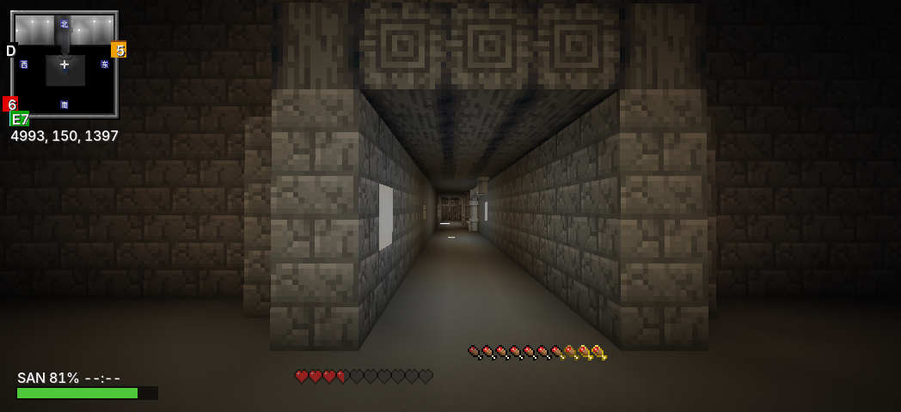

## 区域30-35:向日葵田 (unreachable after plot)
Safety等级: 1
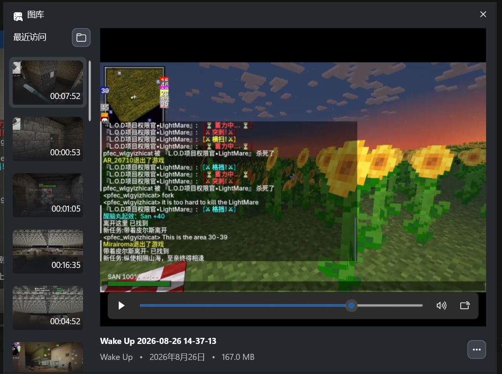

区域30-39去往。

## 区域30-39  (unreachable after plot)
Safety等级: 1

带皮尔斯离开

区域30-34通关boss（LightMare 200血量）去往。


## 区域36:海上加油站
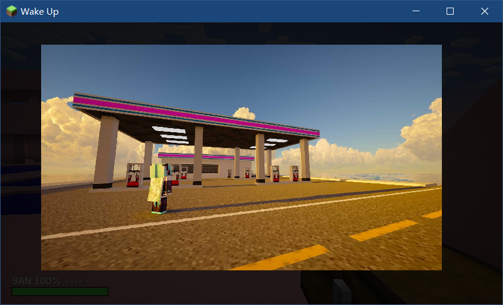
## 区域37:闲人免进
Safety等级: 1

可从区域30去往，疑似整活


## 区域38
Safety等级: 1

有2个NPC，xaeromap看着很大其实不大


## 区域3A
【NO DATA】

## 区域9999999990 (建设服only)
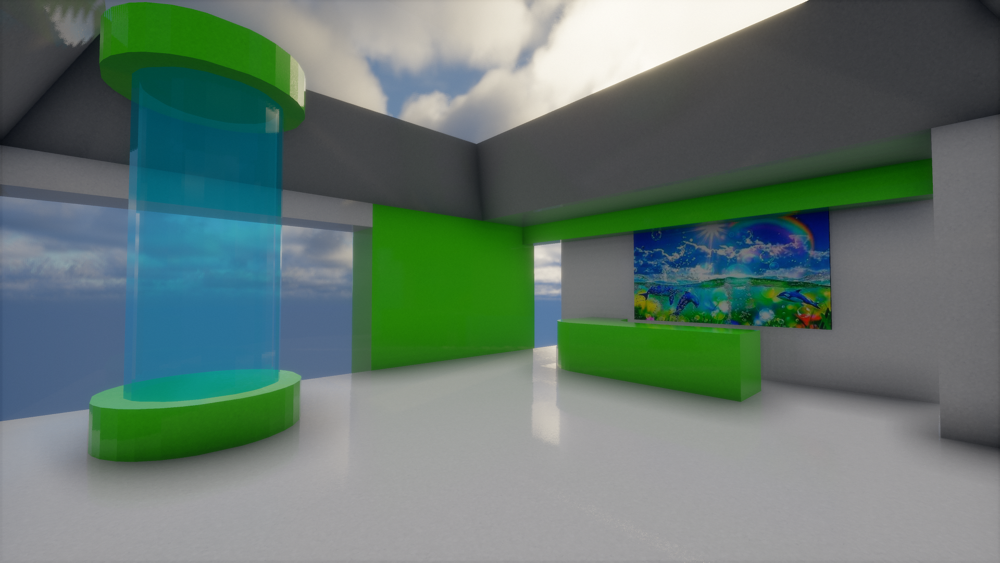

# 实体列表

## Entity Aggresive-01: "LightM@re"
**Entity A-01**是外表有错误状白色的实体，手拿三叉戟。


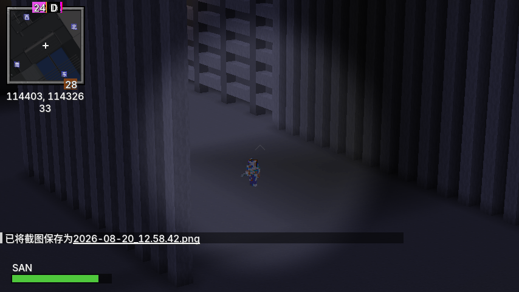

文档作者留言：还好和苦力怕一个鸟样（红色框为后期添加）


文档作者留言：wc当时把我吓死了，还好我是pve大神

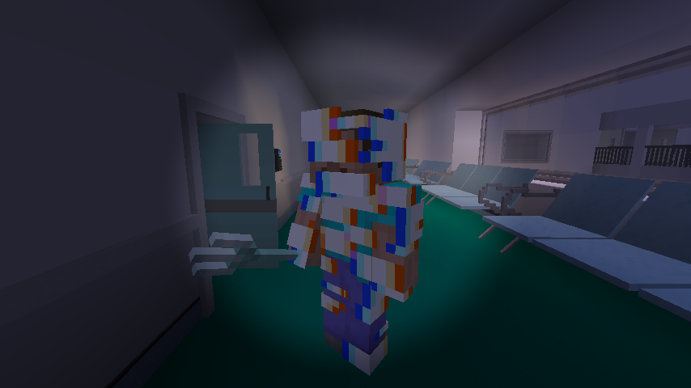
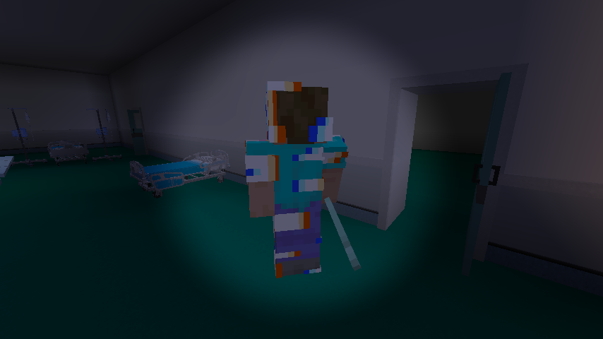

文档作者留言：可远观而不可亵玩焉

**Entity A-01**可能与区域30-32中记录1的作者***Lightmare***有关，需加以注意

已知出没地点：
* 区域22 -204 55 -10274附近（目击者）
* 区域24 114350 13 114291附近（截至2026年8月20日，具体坐标通过自由视角mod远程复制客户端实体数据查明，具体行为未查明）
* 区域30-31
* 区域13（由Jesse.C发现）
* 区域30-33


## Entity Aggresive-02: "The_lost"
**Entity A-02**移动较慢，通常跑一会儿就可使该实体失去追踪目标

已知出现地点：
* 区域07-02
* 区域30-31
* 区域13
* 区域30-33

文档作者留言：把他当狗整就行了

平均伤害：5/20

[**查看Entity A-02的图片**](./entities/a-02/r13.md)

## Entity Aggresive-03: “潜伏者”
**Entity A-03**未探明
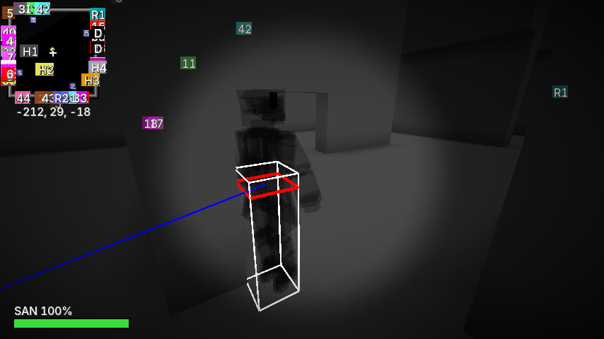
已知出现地点：
* 区域0A-02

文档作者留言：见区域0A-02文档

## Entity Aggresive-04
**Entity A-04**未探明，由Jesse.C发现。
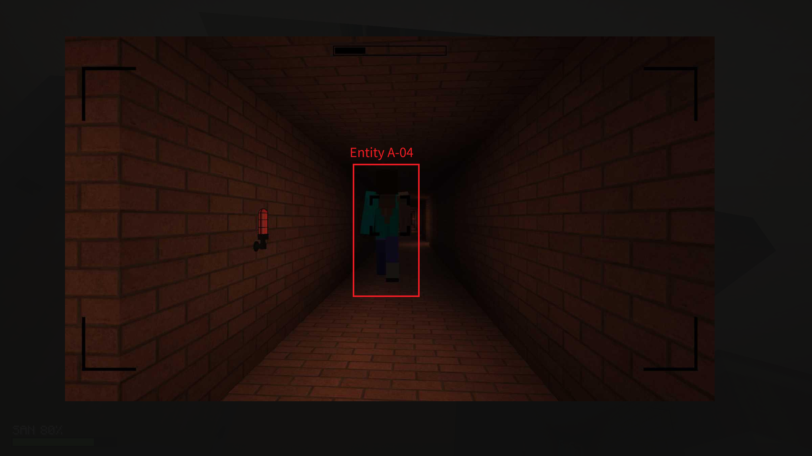

## Entity Aggresive-05
与[Entity N-01为同一实体](#entity-neutral-01)

## Entity Neutral-01: The_wanderer
**Entity N-01**未探明。
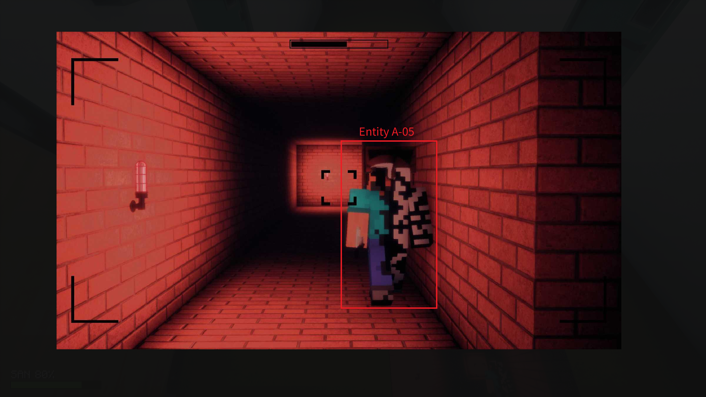
已知出现地点：
* 区域07-02
* 区域13


## Entity Friendly-01: Louis
**Entity F-01**为区域01梦之酒店的前台服务员，NPC。

## Entity Friendly-02: Joseph
**Entity F-02**为区域02中-37 20 -21的NPC。

## Entity Friendly-03: Axolotl
**Entity F-03**为区域02中-100 62 126的NPC。

## Entity Friendly-04: Steve
**Entity F-04**为区域30中20009 51 20009的NPC。

## Entity Friendly-05: DreamcoreServer建设组人员
出现在区域30和区域37。**Entity F-05**为各个建设组人员，已发现有wmry, Mirairoma(𝓟𝓱𝓪𝓷𝓽𝓸𝓶), 白然, dygm, a, 策划组组长

## Entity Plot-01: timing白镜锚点
**Entity P-01**为区域30中20002 51.5 20018的NPC

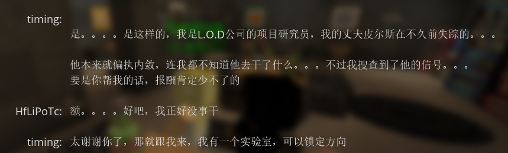

白镜锚点——寻找失踪的前L.O.D高层，并探寻被L.O.D埋藏的阴谋

## Entity Unknown-01: 黑袍
**Entity U-01**为区域01梦之酒店中Louis正z轴边的一个实体。
其也在

已知出现地点：
* 区域01
* 区域30的20002 51.5 20017
* 区域12


## Entity Unknown-02: Doppelganger possesion
**Entity U-02**为玩家san值=0死亡后生成的一个实体。（并不总是这样）该实体可以自主发言。

辨别该发言的方式可以通过不易打出的中文直角引号`「」`和玩家发言左边“服务器修改”灰色杠辨别。

```
[2026/8/21 12:04:22.187] [Render thread/INFO] [net.minecraft.client.gui.components.ChatComponent/]: [Modified] [CHAT] <Luosen1014> 你刚才不是说「？」吗？
```


文档作者留言：$你刚才不是说「\alpha\mapsto你刚才不是说「\alpha」吗？ \text{fixed point}」吗？=\mathrm{Y}(1,3,4,2,5,8,10)$


## Entity Unknown-03: ???
可从区域30-34找到

## Entity Unknown-04: ???
可从区域02-02-02, 区域11找到

<del>

## Entity Unknown-03: Pomsciwojistaw
**Entity U-03**为区域30-01的一个NPC，藏在墙内

## Entity Unknown-04: Paloma Unzar
**Entity U-04**为区域30-01的一个NPC，藏在天花板

</del>


# 机制

## san值
初始100%,死亡后设为80%

san值为0会出现VHS故障效果，无论SAN值如何，玩家都会在约6秒后死亡。

当有玩家在附近，死亡后会生成**Entity U-02**。

减少san值的方式有：玩家(20)血量每减1,san值减1；block亮度<=3(+sky亮度？)时会减少san值。

升高san值的方式：在？？环境中在水中游泳；block亮度>=12(+sky亮度？)时san值会升高。


# 杂项


## 有关建设群的资料

建设群有20+人，与建设服有关，进入方式未知。

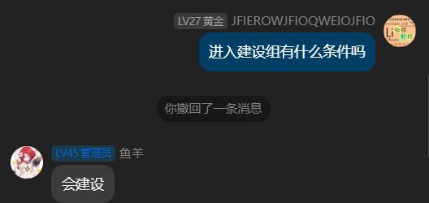
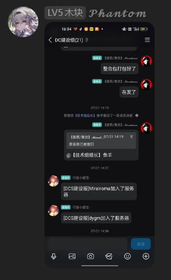
DCS存在内群“Dreamcore_Server内群”，前身为backrooms交流群，该内群实际上无用。

“DC建设组”群，推测为讨论下一次更新的计划，以及服务器的世界观，有正确的建设服IP的群。

## sanity & scanner mod资料
sanity 和 scanner同属包名`com.lookout3d`，但两个mod并非出自Lookout3D之手。该两个mod可能由dygm和某个未知人士制作。

sanity和scanner mod采用了两端分离方式，对外提供client+common版本，而server+common版本不公开，仅向DreamcoreServer使用。

因此sanity和scanner mod的client版本无法在未安装server+common版本的服务器/单人游戏上正常运行。

## 伪人 资料
伪人属于sanity mod，伪人的自主发言特性由sanity的server+common版本完成。

## STUN打洞资料

服务器使用STUN打洞来规避使用公网服务器上的frp。

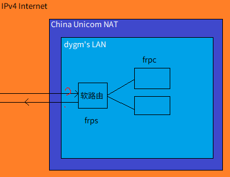

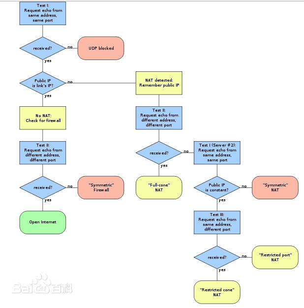

## 服务器历史

```
backrooms服务器历史 *:10 -:11 +:12 2022/7/05 weimouren_ac首次准备建立一个服务器backrooms服务器,前身为生存服务器 至 描述： 2022/8/04 第一个生存服存档架设在weimouren的电脑上，所以开放时间很短， 最后由于卡顿被删档 第二个生存服存档还是卡顿严重， weimouren为了解决卡顿开始炸出生点， 所以第二个生存服存档被称为2b2t分t 从2b2t分t开始服务器由dygm架设并24小时运行 这也是dygm被称为物理腐竹的原因 第三个生存服务器存档也是最值得怀念的生存服务器存档，当时服务器正处辉煌时刻 每天都有两人以上在线 weimouren也在里面建造了堪称经典的矿石塔（非官方名称）但由于dygm家里的一些事服务器被迫关闭一段时间， 这段时间weimouren对外公布了想开backroom服务器的想法 2022/8/04 第三个生存服务器存档这最终于将最后的备份交给weimouren之后下落不明 只剩群相册里的几张照片可以证明它曾经存在过 同时backroom服务器正式起航 2022/8/15之前 服务器开启白名单，开启IPv6 2022/8/15 服务器关闭白名单 2022/8/15 asdasddads提出了level998的结构 2022/8/16 asdasddads(工具人:指有错的服务端后) 设为op 2022/8/16 asdasddads发布了第一个backrooms&MC作品 2022/8/16 asdasddads提出了造level-1的想法 2022/8/16 ========内测时期======== 
2022/8/17 第一个“服务器规则” 
2022/8/17 weimouren_ac(USSR)提出把26个英文字母大小写全部弄一个方块 2022/8/17 weimouren_ac将level998面积尝试调为1319*1319 2022/8/17 部分人发现level10和level14生物群系混乱 
2022/8/17 有史以来堆栈最快的一次 2022/8/17 dygm提出MCreator整个远程工作区 
2022/8/17 asdasddads发现level 188的生物群系是minecraft:level_14swqx 
2022/8/25 ydxc2009入群 
2022/8/25 weimouren_ac投票是否同意ydxc2009当管理员 
2022/9/08 前轱辘不转后轱辘转思密达(asdasddads)准备开设服务器官网 2022/9/15 steve觉得TAB币没用就打掉TAB币告示牌，被ydxc2009封禁，与当天20点左右解封 
2022/9/15 著名ydxc2009事件：ydxc2009由于长期嘴臭辱骂群友在插件里写侮辱信息，在steve解封后50分钟左右被封禁 2022/9/16 
========公测时期======== 
描述：随着ydxc2009被ban，公测时期也随之到来，会发生怎么样精彩的事情呢？ 2022/*/06 (非本群记录)前轱辘不转后轱辘转思密达尝试邀请WeiXiaoTing，WeiXiaoTing同意且成功进群 2022/*/22 (非本群记录)WeiXiaoTing尝试邀请AImixAE 2022/+/30 刘合*不知道名字被谁改了在群内骂人 2023/2/25 365kw发癫发誓要炸生存服 2023/3/01 前轱辘不转后轱辘转思密达邀请杨晨七入群 2023/3/11 前轱辘不转后轱辘转思密达藏32k和武器库因建筑问题被发现
*2023/3/11至2025/8/17大部分数据丢失*
2023/3/22 weimouren提出想把brs变成梦核/怪核/阈限空间服务器
========新时代========
2025/8/17 dygm在灰羊服务器被踢出，决定开始“重启brs计划”
2025/8/23 dygm发布群公告，计划正式立项
2025/9/30 计划失败，原因:模组太史了，移植不到新版本
2025/12/14 昔日(weimouren)宣布重启后室服务器
2026/1/1 “新年快乐！” “今年brs能复活吗？”
2026/1/11 昔日宣布brs复活，并邀请dygm再次担任物理服主
2026/1/14 浅白音然加入群聊
2026/1/17 a提出brs服务器的新名字:“DreamCore Server”
2026/1/18 服务器正式开服，并改名为DreamCore Server，其他更改如下
版本:1.20.1→1.21.1
mod加载器:forge→Neoforge
服务端:mohist→yours
brs群正式改为DreamCore Server内群
23:48，dygm添加了以easybot为框架的QQ机器人
2026/1/31 昔日宣布2026/2/1开启内测
2026/2/2 dygm为DreamcoreServer编写了模组，添加了一些成就物品，重置了brs中l0的部分方块
2026/2/3 昔日提出在模组中添加两个锁定时间为白天和午夜的维度用来存放特殊层
2026/2/6 very6回归服务器（据他后来承认，是通过dygm在github更新的PCL主页发现服务器的）
2026/2/13 
早上 dygm通过迁移napcat程序到Linux，缓解了机器人频繁掉线问题
晚上 军师 加入群聊，并说了服务器联盟的事
```
## 各个人士资料

### 建设组内
WEAI_昔日: 曾用名weimouren，服主，建设组内策划组组长

dygm: 建设组内技术部组长，熟悉Java

Mirairoma: 建设组内建筑/策划

a(ahh_mc): 建设组内建设/策划

wmry: 建设组内建筑

1: sanity & scanner模组的作者

> 此6人所负责的内容是通过部分泄露的建设组内的聊天记录而判断的。

### 建设组外

### 位置未知