# Weimouren's Dreamcore Server 各个区域
## 三次更新
1. 1月初内测
2. 2/23
3. 6/20
4. 8/17

该文档存在剧透，请谨慎阅读！

<br />
<br />
<br />
<br />
<br />
<br />
<br />
<br />
<br />
<br />
<br />
<br />
<br />
<br />
<br />
<br />


Safete等级说明:
1. 等级1：无有害实体（大多数层级）
2. 等级2：存在至少1个有害实体，密度较小（07-02, 0A-02, 13, 22, 24）
3. 等级3：存在至少6个有害实体，密度较大（30-31）

## 区域01: 梦之酒店
Safety等级: 1

第二次更新后玩家的初始重生点。
### 区域01-001
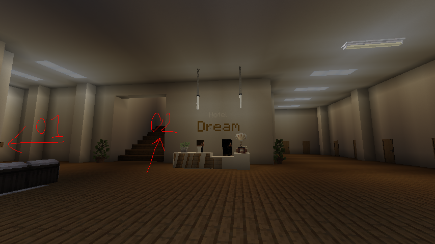
区域01-001有一个前台，有2个NPC

### 区域01-001-Room 202
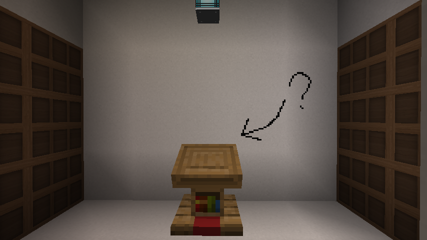
Entrance
1. 可通过区域01-001图中02进入。

### 区域01-002

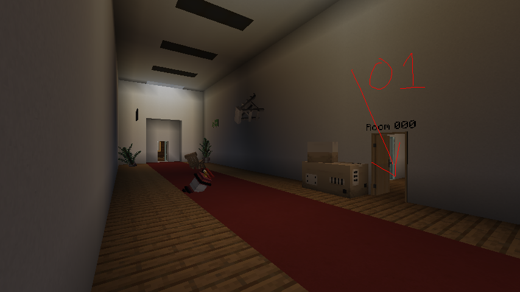
Entrance
1. 可通过区域01-001图中01进入。

## 区域02-01:池核A区
Safety等级: 1
Entrance
1. 可通过区域01-002中Room 000 进入。

Exit
1. 区域02-01到区域02-02在第3次更新前存在一个出口，其通往区域03.
2. -1,25,2的压力板可去往区域21

## 区域02-02:池核B区
Safety等级: 1
## 区域02-02-01:繁茂洞穴
Safety等级: 1
## 区域02-02-02:跑酷圣地
Safety等级: 1
## 区域03:草地长廊 (unreachable)
Safety等级: 1
Exit
1. 走到草地长廊的尽头可以前往区域04
## 区域04:图书馆
Safety等级: 1
1. 第2次更新前存在一个按钮可以通往区域05
## 区域05:立方体 (unreachable)
Safety等级: 1
1. 立方体的顶端可以通往区域06
## 区域06:暗走廊
Safety等级: 1
1. 正z轴方向可去往区域12
2. 负z轴方向可去往区域02-02
## 区域07:郊区
Safety等级: 1
可从区域02-02去往
## 区域07-02:郊区
Safety等级: 2
可从区域02-02去往
存在躺在地上的敌对实体

文档作者留言：一上来有只狗就把我当狗整

## 区域08:滑滑梯
Safety等级: 1
可从区域02-02去往

## 区域09:视力测试
Safety等级: 1
可从区域02去往


## 区域0A-01:暗室
Safety等级: 1
可从区域02和区域21去往，可能还有其他入口
可使用扫描仪

## 区域0A-02:暗室 Pro max
Safety等级: 2
可从区域0A-1中绿色去往
存在潜伏者

文档作者留言:
```
[2026-8-17 17:44:01.631] [Render thread/INFO] [net.minecraft.client.gui.components.ChatComponent/]: [CHAT] <pfec_wlgyizhicat> wc theres somethign here
[2026-8-17 17:44:07.664] [Render thread/INFO] [net.minecraft.client.gui.components.ChatComponent/]: [CHAT] <pfec_wlgyizhicat> i错了
[2026-8-17 17:44:09.468] [Render thread/INFO] [net.minecraft.client.gui.components.ChatComponent/]: [System] [CHAT] pfec_wlgyizhicat被潜伏者杀死了
[2026-8-17 17:44:11.481] [Render thread/INFO] [net.minecraft.client.gui.components.ChatComponent/]: [CHAT] <pfec_wlgyizhicat> no
```

## 区域0B:破碎
Safety等级: 1
可从区域09去往（房子端）


## 区域10:露天图书馆
Safety等级: 1
可从区域04去往

## 区域11:深水区
Safety等级: 1
可从区域02,区域24去往

## 区域12:暗走廊B区
Safety等级: 1
从区域06正z轴方向去往
## 区域13:全是红砖的区域
Safety等级: 2
可从区域0A去往
## 区域14:黄昏之海(Dusksea)
Safety等级: 1
可从区域13去往
## 区域15:螺旋楼梯
Safety等级: 1
可从区域0B,区域11去往
## 区域16:dreamcore:light
Safety等级: 1
## 区域17:300层楼梯
Safety等级: 1
## 区域18:The end
Safety等级: 1


## 区域20:Level 94
Safety等级: 1
1. 区域12可去往
2. 区域27可以钻的画可去往
## 区域21:摩天办公楼
Safety等级: 1
## 区域22:无尽图书馆
Safety等级: 2
从区域10去往

## 区域23:儿童室
Safety等级: 1
## 区域24:地上砼核
Safety等级: 2
1. Level94一端有卡车的路面可去往
2. 区域09进去后反着走右边可去往
## 区域25:地铁站
Safety等级: 1
1. 区域26可去往
## 区域26:商场
Safety等级: 1
1. 区域12可去往
## 区域27:草地长廊
Safety等级: 1
长度比区域03长

## 区域30:云端酒店
Safety等级: 1
可从区域07去往
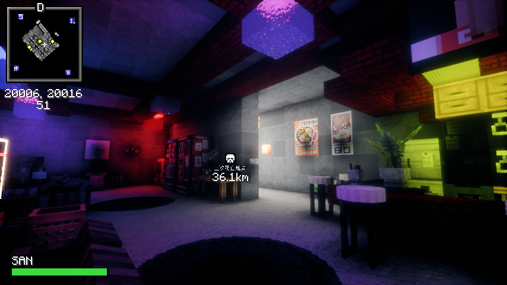

### 区域30-01:timing的实验室
Safety等级: 1

### 区域30-31 or 713-02:废弃医院
Safety等级: 3
可通过区域30-01（第二站）进入
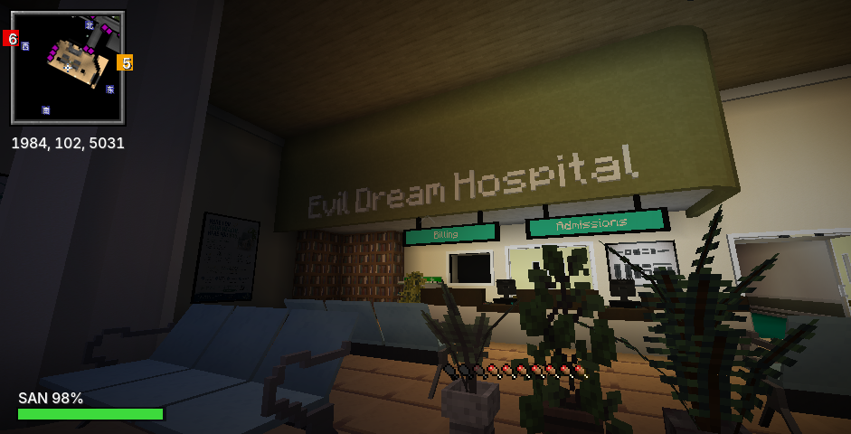

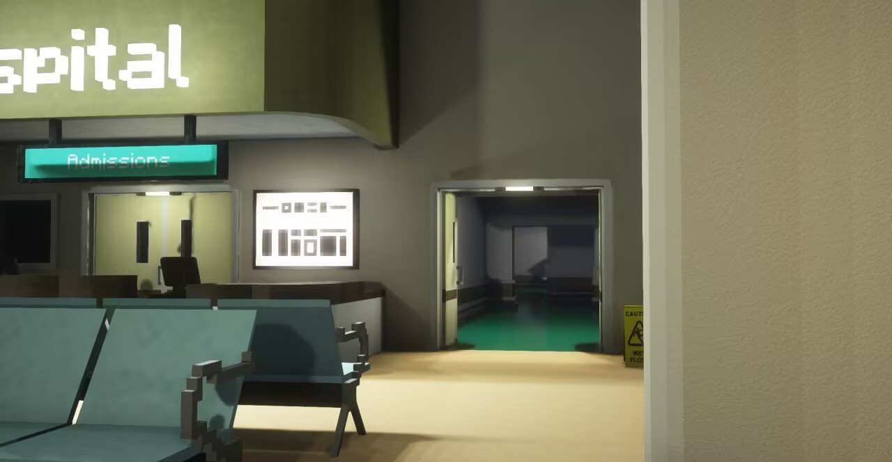


### 区域30-32 or 713-01:无主的卧室
Safety等级: 1
可通过区域30-01（第一站）进入

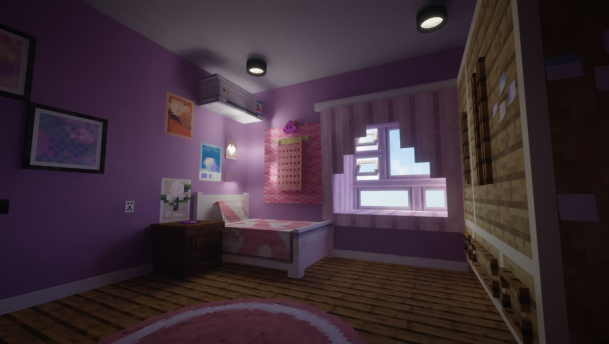
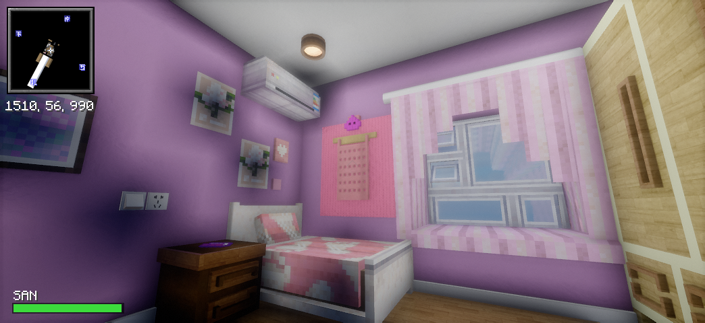

[查看记录1（剧透预警）](./entities/aggre1.md)

## 区域33:办公室……?
[NO DATA]

## 区域34:L.O.D地下室
[NO DATA]

## 区域35:向日葵田
[NO DATA]

## 区域36:海上加油站
[NO DATA]

## 区域37:闲人免进
Safety等级: 1
可从区域30去往，疑似整活
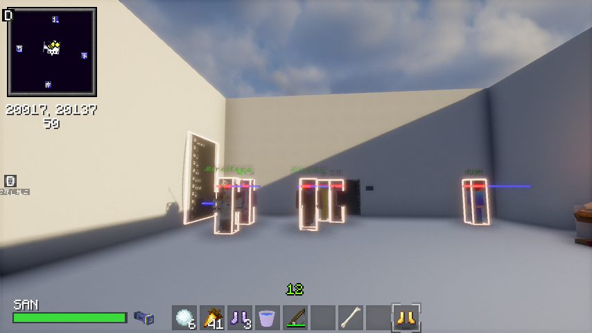

## 区域38:待定
Safety等级: 1
有2个NPC，xaeromap看着很大其实不大
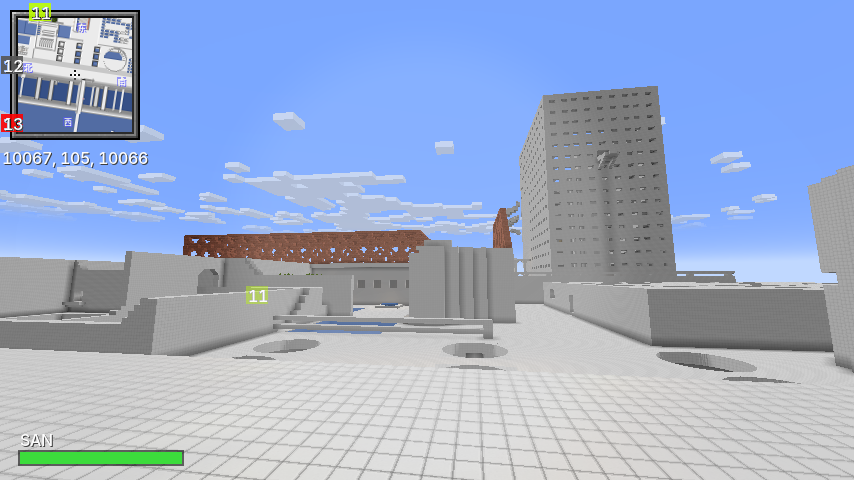


# 实体列表

## Entity Aggresive-01: "LightM@re"
**Entity A-01**是一个伤害不高但外表诡异的实体
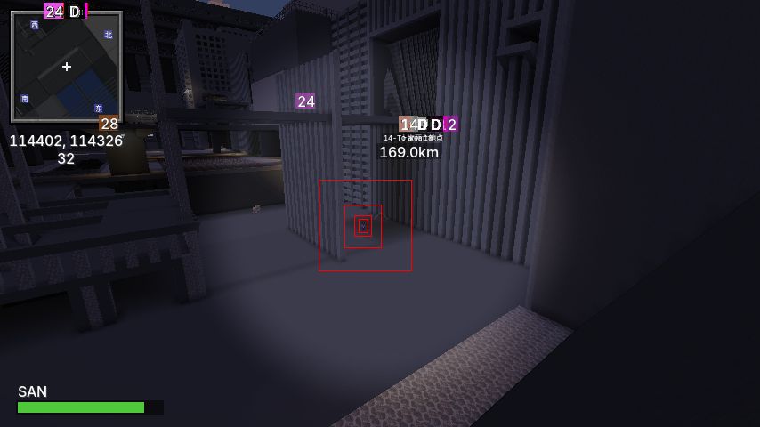
文档作者留言：还好和苦力怕一个鸟样（红色框为后期添加）

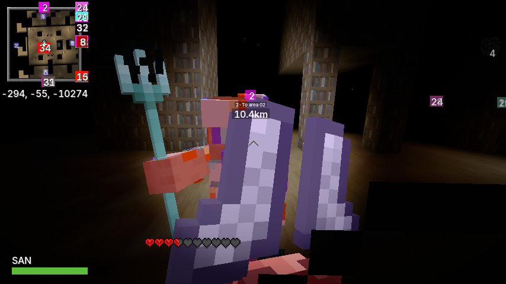

文档作者留言：wc当时把我吓死了，还好我是pve大神

已知出没地点：
* 区域22 -204 55 -10274附近（目击者）
* 区域24 114350 13 114291附近（截至2026年8月20日，具体坐标通过自由视角mod远程复制客户端实体数据查明，具体行为未查明）
* 区域30-31

更多信息见`entities`文件夹的`aggre1-*.png`

## Entity Aggresive-02: “The_lost”
**Entity A-02**移动较慢，通常跑一会儿就可使该实体失去追踪目标

已知出现地点：
* 区域07-02
* 区域30-31

文档作者留言：把他当狗整就行了

平均伤害：5/20

## Entity Aggresive-03: “潜伏者”
**Entity A-03**未探明

已知出现地点：
* 区域0A-02

文档作者留言：见区域0A-02文档

## Entity Friendly-01: Louis
**Entity F-01**为区域01梦之酒店的前台服务员，NPC。

## Entity Friendly-02: Joseph
**Entity F-02**为区域02中-37 20 -21的NPC。

## Entity Friendly-03: Axolotl
**Entity F-03**为区域02中-100 62 126的NPC。

## Entity Friendly-04: Steve
**Entity F-04**为区域30中20009 51 20009的NPC。

## Entity Friendly-05: DreamcoreServer建设组人员
出现在区域30和区域37。**Entity F-05**为各个建设组人员，已发现有wmry, Mirairoma(𝓟𝓱𝓪𝓷𝓽𝓸𝓶), 白然, dygm, a, 策划组组长

## Entity Plot-01: timing白镜锚点
**Entity P-01**为区域30中20002 51.5 20018的NPC

## Entity Unknown-01
**Entity U-01**为区域01梦之酒店中Louis正z轴边的一个实体。
其也在

已知出现地点：
* 区域01
* 区域30的20002 51.5 20017


## Entity Unknown-02: Doppelganger possesion
**Entity U-02**为玩家san值=0死亡后生成的一个实体。（并不总是这样）该实体可以自主发言。

辨别该发言的方式可以通过不易打出的中文直角引号`「」`和玩家发言左边“服务器修改”灰色杠辨别。

```
[2026/8/21 12:04:22.187] [Render thread/INFO] [net.minecraft.client.gui.components.ChatComponent/]: [Modified] [CHAT] <Luosen1014> 你刚才不是说「？」吗？
```
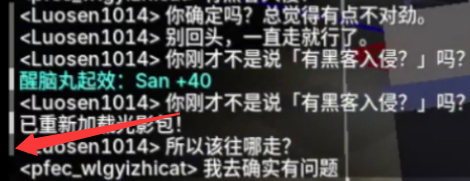

文档作者留言：$你刚才不是说「\alpha\mapsto你刚才不是说「\alpha」吗？ \text{fixed point}」吗？=\mathrm{Y}(1,3,4,2,5,8,10)$

<del>

## Entity Unknown-03: Pomsciwojistaw
**Entity U-03**为区域30-01的一个NPC，藏在墙内

## Entity Unknown-04: Paloma Unzar
**Entity U-04**为区域30-01的一个NPC，藏在天花板

</del>


# 机制

## san值
初始100%,死亡后设为80%

san值为0会出现VHS故障效果，当有玩家在附近，死亡后会生成**Entity U-02**

减少san值的方式有：玩家(20)血量每减1,san值减1；亮度太低时会减少san值。

升高san值的方式：在？？环境中在水中游泳；靠近亮度高的地方。

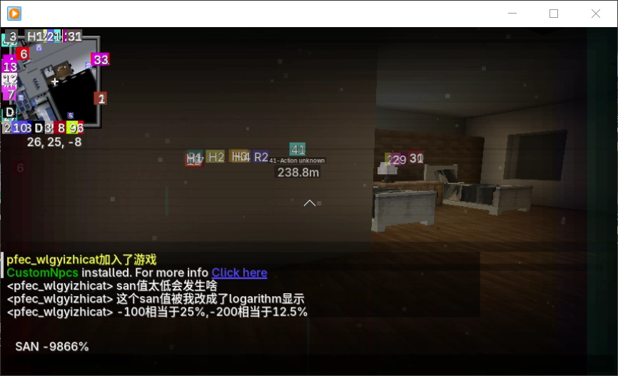
