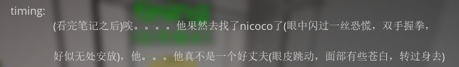
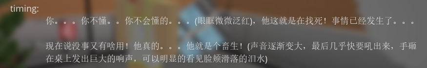
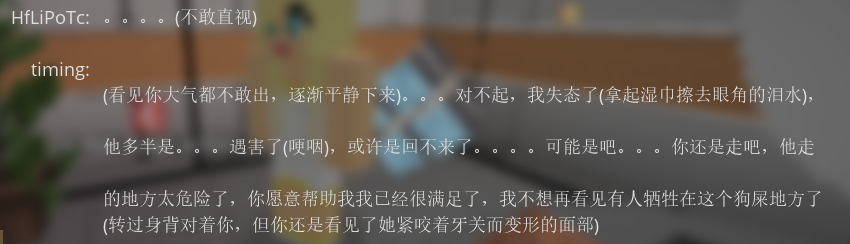
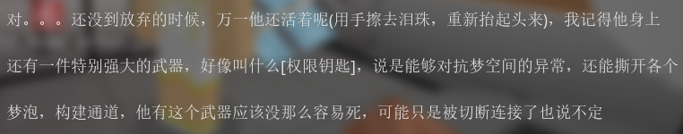
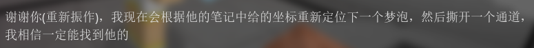
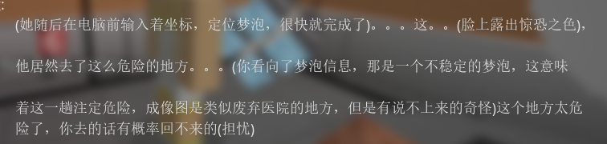

# 记录1
> 从`aggre1-*.png`系列图片转写。作了部分修改。

记录人：**Lightmare**(项目权限官)

> 注意，**Lightmare**与**Entity A-01**重名，**Entity A-01**可能是**Lightmare**死后的残留体。

记录时间：#@#$!%

权限等级：绝密·个人勘探存档

## 【环境检测报告|职业正式内容】

本次切入梦境泡编号：713-01

> 即为区域30-02

场景溯源：未知亡者孩童残留记忆场，无高危暴力记忆、无死亡创伤核心，属于低侵蚀良性梦泡

环境参数检测：
1. SAN侵蚀速率：$0.02\%\cdot\min^{-1}$（极低，属于安全勘探区间）
2. 空间稳定性：$91\%$，结构完整，无循环重置机制
3. 异常体数量：微量浮动残响，无成型高危噩梦实体
4. 锚点匹配度：$37\%$

为本轮搜索以来，第一次捕捉到与我女儿意识波段高度重合的共振信号。

本次为私人越级勘探，未报备公司，自主解锁浅层梦境准入权限。

进入空间后，场景高度固化：标准女童卧室、陈设完整、光影柔和、无杂音、无恐怖畸变。

全程执行标准勘探流程：

空间扫描、记忆碎片溯源、波段筛选、锚点定位

本层梦境不属于我女儿童年记忆，是陌生孩童的日常居所空间干净、无痛苦执念、无循环折磨，是整片713集群里最温【REDACTED】

> 此处原文丢失，为玩家安装的ModernUI所致。

我排查了房间所有记忆节点：玩具、绘本、床铺、窗台、衣柜。未找到目标意识本体。

> 此处目标意识应该是文中的“我女儿”。

但这里的波段频率高度贴合女儿消散前的残留波动

推测：她的意识碎片曾短暂停留此处，借温和梦境缓冲消解痛苦

> 很明显“我女儿”出现了什么问题

勘探中途触发两处微弱残响躁动，为过往迷失勘探员残留碎片，无智力、无高权限、仅本能游荡

> 可能和“残响体”有关

已手动压制、驱散、封存本层无威胁，可安全通过

<b><i>
我找了很久。

整片纯白、无数破碎梦境、无数别人的痛苦

这是我第一次感受到——她离我这么近

房间很小、很干净、很安静

像她小时候睡着的样子

我坐在床边停留了很久

哪怕这不是她的房间

哪怕这里什么都没有

我太想再见她一次

太想、太想

信号指向深处

下一层坐标锁定：儿科医疗记忆域
</i></b>

> 即为区域30-31(713-02)

<b><i>
我继续深入

无论代价是什么

无论SAN损耗、无论违规、无论理智崩塌

我必须找到她
</i></b>

## 【最终勘探结论丨官方收尾】

713-01梦境泡勘探完成，无安全隐患

> 需注意玩家在通关区域30-32(713-01)后与timing交谈时获得的权限钥匙残片，与**Entity A-01**手上拿的三叉戟几乎一致

